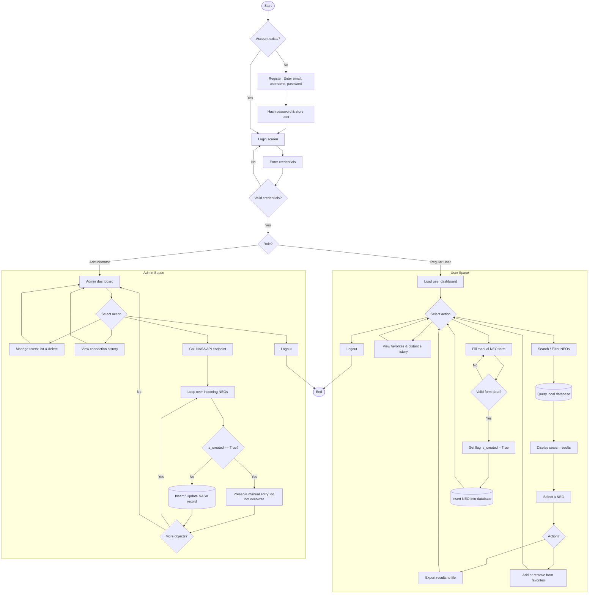

```mermaid
%%{init: {'flowchart': {'curve': 'linear'}}}%%
flowchart TD
    Start([Start]) --> LoginOrReg{Account exists?}

    %% Authentification
    LoginOrReg -- No --> Register[Register: Enter email, username, password]
    Register --> Hash[Hash password & store user]
    Hash --> Login[Login screen]
    LoginOrReg -- Yes --> Login
    
    Login --> Submit[Enter credentials]
    Submit --> CheckAuth{Valid credentials?}
    CheckAuth -- No --> Login
    CheckAuth -- Yes --> CheckRole{Role?}

    %% Routage des rôles
    CheckRole -- Regular User --> Dashboard[Load user dashboard]
    CheckRole -- Administrator --> AdminMenu[Admin dashboard]

    %% ==========================================
    %% FLUX UTILISATEUR
    %% ==========================================
    subgraph Regular_User [User Space]
        Dashboard --> UserMenu{Select action}
        
        %% Recherche
        UserMenu --> Search[Search / Filter NEOs]
        Search --> QueryDB[(Query local database)]
        QueryDB --> DisplayList[Display search results]
        DisplayList --> SelectNEO[Select a NEO]
        SelectNEO --> ActionNEO{Action?}
        ActionNEO --> Export[Export results to file]
        ActionNEO --> FavToggle[Add or remove from favorites]
        Export --> UserMenu
        FavToggle --> UserMenu

        %% Favoris
        UserMenu --> ViewFavs[View favorites & distance history]
        ViewFavs --> UserMenu

        %% Création manuelle
        UserMenu --> CreateNEO[Fill manual NEO form]
        CreateNEO --> CheckForm{Valid form data?}
        CheckForm -- No --> CreateNEO
        CheckForm -- Yes --> SetFlag[Set flag is_created = True]
        SetFlag --> SaveManualNEO[(Insert NEO into database)]
        SaveManualNEO --> UserMenu

        UserMenu --> UserExit[Logout]
    end

    %% ==========================================
    %% FLUX ADMINISTRATEUR
    %% ==========================================
    subgraph Admin_Space [Admin Space]
        AdminMenu --> AdminChoice{Select action}
        
        %% Gestion utilisateurs
        AdminChoice --> ManageUsers[Manage users: list & delete]
        ManageUsers --> AdminMenu

        %% Logs
        AdminChoice --> ViewLogs[View connection history]
        ViewLogs --> AdminMenu

        %% Sync API NASA
        AdminChoice --> CallAPI[Call NASA API endpoint]
        CallAPI --> ProcessData[Loop over incoming NEOs]
        ProcessData --> CheckManual{is_created == True?}
        CheckManual -- Yes --> Skip[Preserve manual entry: do not overwrite]
        CheckManual -- No --> UpdateDB[(Insert / Update NASA record)]
        Skip --> EndLoop{More objects?}
        UpdateDB --> EndLoop
        EndLoop -- Yes --> ProcessData
        EndLoop -- No --> AdminMenu

        AdminChoice --> AdminExit[Logout]
    end

    UserExit --> EndState([End])
    AdminExit --> EndState([End])
```