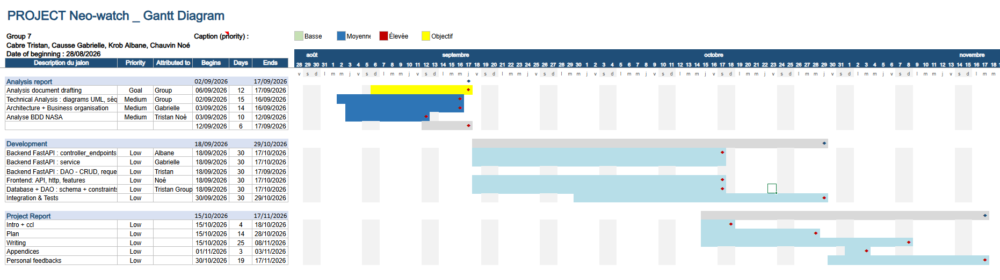
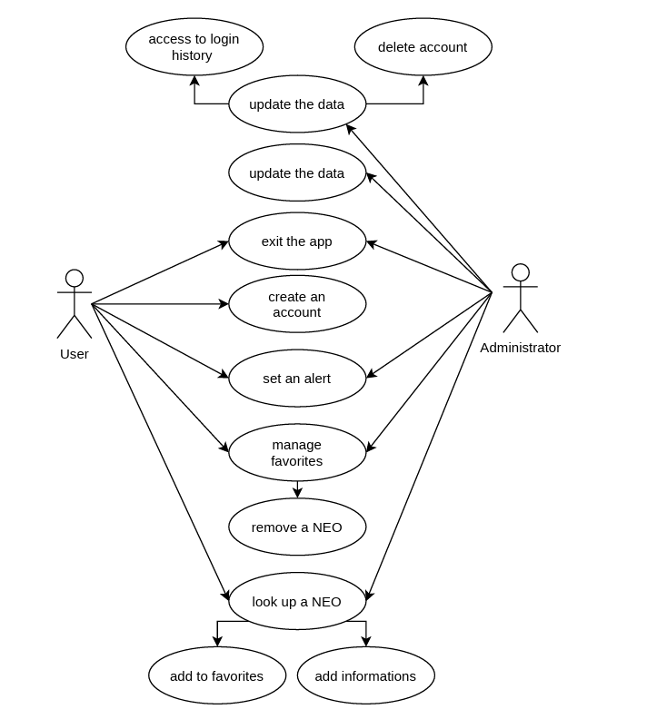
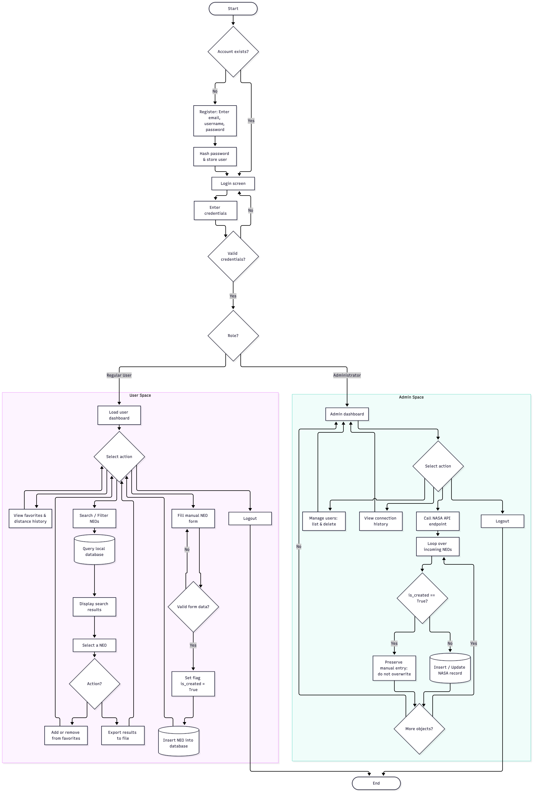
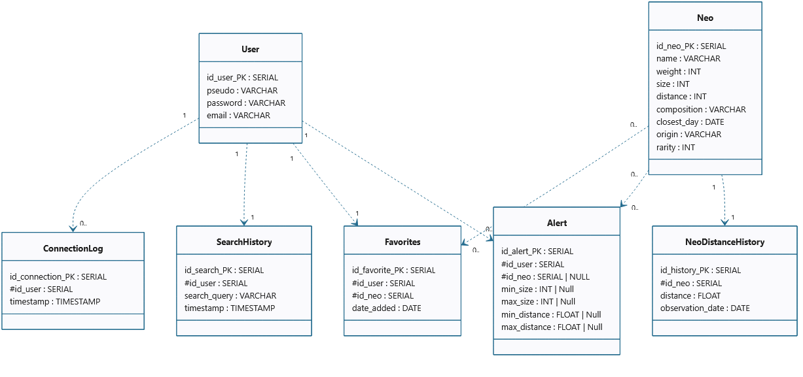
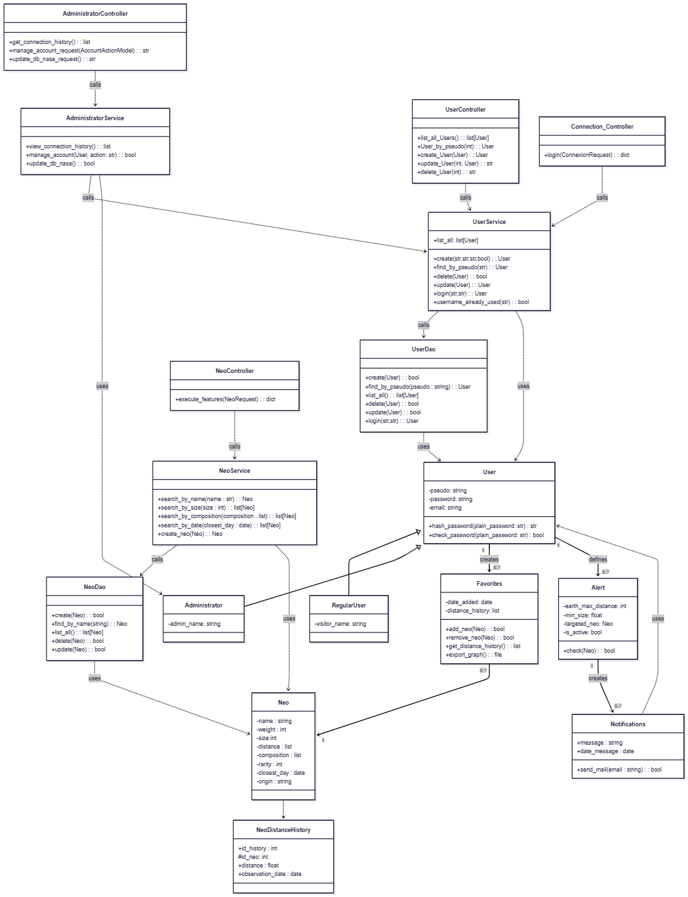
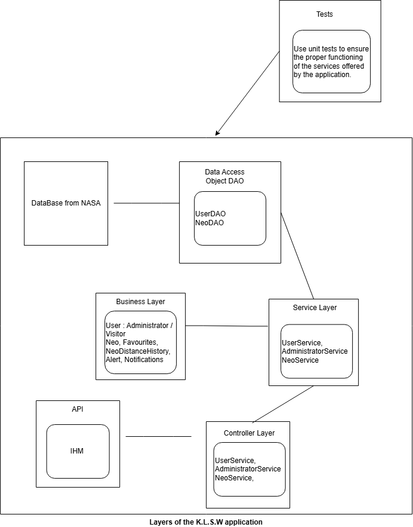

```{=typst}
#import "model.typ": project_template

#show: body => project_template(
  title: [Analysis Report on the NEO-Watch Project],
  team: [Group 7],
  authors: ([Tristan Cabre], [Gabrielle Causse], [Albane Krob], [Noé Chauvin]),
  tutor: [M. Ricciardi],
  project: [2nd-Year Computer Science Project – 2026–2027 Academic Year],
  body
)
```

## Introduction {.unnumbered}

  Who has never watched shooting stars in the sky as a kid, wondering what they were and where they came from ? Growing up, we all learned that theses beautiful lights were due to the high-speed dust of meteorite coming in the atmosphere, before it inevitably destroy it. However, what would happen if it was not just the dust of the meteorit, but the meteorit itself which was coming straight to us through the atmosphere ? Wouldn't we like to know ? And if we do, could we avoid it ? At least, we know that the dinosaurs didn't ask themselves this question…

  As humanity was a little more concerned about these small Solar System bodies than its predecessors on Earth, the US government tasked NASA with cataloguing 90% of Near-Earth Objects (NEOs) with a diameter greater than 1 km within ten years. Additionally, in 2016, NASA was asked not only to list the threats, but also to create a solution in case of an unavoidable collision trajectory. With this in mind, NASA launched the space mission DART (Double Asteroid Redirection Test) in 2022, resulting in a success by significantly changing the trajectory of the small asteroid Dimorphos. 
   
  The objective of this project is to develop an intuitive and secured application, coded in Python, that queries NASA's API in order to track and monitor these Near-Earth Objects. Designed to handle distinct access levels for regular users and administrators, the system provides an interactive dashboard highlighting close approaches and hazardous celestial bodies. 
   
  From querying specific NEOs by size or trajectory to managing personalized favorites and registering newly spotted objects, the application delivers actionable planetary defense insights at anyone's fingertips. The first part of this report will be devoted to the preliminary analysis of the project, detailing the functional requirements, constraints, and team organization. The second part will address the technical design, including the use case and activity diagrams, as well as the database schema and architecture.




## Conception of the application

### Specifications

NEO-Watch addresses a genuine planetary-defense concern by tracking Near-Earth Objects (asteroids and comets). Beyond this evocative framing, the project raises several concrete stakes. First, the application depends entirely on NASA's public API for its data, which makes data reliability and availability critical success factors: any downtime or inconsistency on NASA's side directly affects the quality of the service offered to users. Second, the system must guarantee data integrity across successive updates, since NEOs created manually by users (feature F4) must never be overwritten when the database is refreshed with new data from NASA — a non-trivial synchronization and versioning challenge. Third, NEO-Watch must serve two distinct audiences with different needs: casual users who simply want a quick overview through the dashboard and alerts, and more engaged users who will use advanced features such as favorites tracking, comparisons, or statistics; the interface and architecture must accommodate both without becoming complex. Finally, security and access control are important, since the application distinguishes between regular users and administrators and must protect personal data such as favorites, search history, and alert configurations, while also ensuring that time-sensitive alerts are computed and delivered promptly to remain useful.

The core of NEO-Watch revolves around six mandatory features. User and access management (F1) establishes two categories of accounts : regular users, who authenticate via login and password to access their personal space, and administrators, who can manage accounts, consult connection history, and trigger updates of NEO data from NASA's API. A personalized dashboard (F2) then gives each user a synthetic view of relevant information, such as upcoming close approaches, the number of potentially hazardous NEOs, the closest object over a given period, and highlights drawn from the user's own favorites. The browsing feature (F3) allows users to search and filter NEOs by criteria such as name, identifier, size, or next passage date, with sortable results and export capabilities. Users can also contribute directly to the dataset through NEO creation (F4), provided that these manually added entries are preserved during subsequent synchronizations with NASA's API. A favorites management feature (F5) lets users build a personal watchlist, keeping a history of each favorite NEO's distance from Earth over time and allowing that history to be exported as graphs. Finally, the alerting feature (F6) enables users to define custom notification rules (for instance, being warned when an asteroid above a certain size passes within a specified distance of Earth) with notifications delivered at the user's next login.

Beyond these mandatory features, several optional enhancements can enrich the application. Users could compare multiple NEOs side by side on criteria such as size or danger level (FO1), consult their own search history over the past thirty days while administrators access any user's history (FO2), or explore built-in statistics such as monthly approach counts or size distributions (FO3). The application could also recommend particularly interesting NEOs to observe based on combined criteria of size, rarity, or danger (FO4). The application could also support email communication between users and administrators for bug reports or account notifications (FO5), allow users to propose corrections to NEO data for administrator review (FO6), automate the periodic reloading of NASA's data through batch processing (FO7), and, on a lighter note, let users export NASA's daily astronomy picture (FO8).

The mandatory technology stack centers on Python, with FastAPI handling the backend, PostgreSQL providing persistent storage, pytest supporting the test suite, and Git managing version control. On the frontend side, we must choose between a Python-native interface, using a framework such as Streamlit, Tkinter, or Reflex, and a JavaScript-based solution built with React or Vue. A major constraint stems from the read-only nature of NASA's API: since the application can only retrieve data and never write back to NASA's database, any user-proposed modification (FO6) must remain purely internal, and the refresh strategy for NEO data is bound by whatever availability and rate limits NASA imposes. This, in turn, requires careful data-synchronization logic capable of distinguishing NASA-sourced records from user-created ones, so that periodic updates never silently overwrite manually added NEOs. Role-based access control between regular users and administrators must be enforced consistently at the API level rather than only in the interface, to guarantee that sensitive operations, such as triggering a data update or viewing another user's history, remain properly restricted. Storing time-series data, such as the distance history of favorite NEOs or thirty-day search logs, also calls for a schema specifically designed to handle historical records efficiently in PostgreSQL. Lastly, the delivery of alerts and email notifications introduces a scheduling constraint, since these features require either a background job triggered at login or a periodic scheduled task, each with different trade-offs in terms of complexity and responsiveness.


### Conception's choices

The functioning of the application had to be discussed within the group in order to make the best decisions and to justify our choices throughout the project. This document aims to summarize the main points debated so far, along with the reasoning behind each decision. 

The first point of debate in the design of our application was the distinction between the two types of users. From the very beginning, we understood that having both Administrators and Visitors would be necessary, given the range of features to be implemented. 

This distinction is needed because some services and mandatory features require internal access to information that ordinary users should not have access to, such as the connection history of other users. Allowing every user unrestricted access to this kind of information would compromise the privacy of other users as well as the security of the application. 

This is why an authentication controller is required. It must identify the user upon login and grant access to the appropriate auser interface and set of tools depending on their role. In practice, Administrators can be seen as regular visitors with extended rights, allowing them to manage the application (for example, checking user activity), but not creating a completely separate category of user. 

We decided to build the user interface with Streamlit. Instead of having Streamlit communicate directly with the database, we have to use FastAPI a backend API layer between the frontend and the data. Then, the path of a request will be as such : the Streamlit frontend calls the API, which forwards the request to a Controller, the Controller delegates the business logic to a Service layer which relies on a DAO (Data Access Object) to communicate with the database. This separation of concerns makes the application easier to maintain, and test, since each layer has a well-defined responsibility. 

Through this interface, users will be able to browse the database and search for NEOs (Near-Earth Objects) using filters such as name, date, and composition of the asteroid. They will also be able to build a list of favourites among their searches and receive alerts when a NEO is approaching Earth. In addition, the application will allow users to generate summary statistics and export graphs in response to specific requests, giving them a way to visualize and analyze the data that matters to them. 

To distinguish between visitors and administrators, we plan to use a boolean codification (add in an is_admin field) associated with each user account. This flag will be checked at the Controller level to determine whether a given request should be authorized, ensuring that sensitive endpoints (such as those exposing other users’ connection history) remain restricted to Administrators only. 

Finally, this range of features will require reliable access to the database. We will use PostgreSQL for storage. Rather than allowing each layer or each user session to open its own direct connection, access to the database will be centralized through the DAO layer, using a connection pool. This will help avoid conflicting access, while still allowing multiple users to use the application simultaneously.


### Feature description


### Group organisation

The Gantt chart below represents the work that we plan to accomplish throughout the duration of the project. We decided to divide the project into three main phases: analysis, development and programming, and report writing and oral presentation preparation. This schedule is not intended to be followed to the letter, but rather to provide the group with a general framework for organizing and distributing the workload. It should help us avoid overloading, particularly towards the end of the project or during periods when we have exams. For this reason, we have decided to maintain a steady pace throughout the project. 

Dividing the tasks required to successfully complete the project among the four members of the group is essential to keep track of our progress and deadlines. It is also a way to ensure a balanced distribution of the workload in the group. This organization should also make it easier to identify the tasks that have been completed and those that still need to be addressed and upgraded. 

Furthermore, the immersion days will provide us with additional opportunities to make significant progress on the project. During these days, we will be able to complete an important part of the planned work, work together more efficiently, or focus on specific issues that may require further discussion and attention. These periods of more intensive group work should help us to be up to date with our own schedule. 

The report will be written progressively throughout the project. Nevertheless, most of the writing will take place during the last few weeks. Indeed, we will need to have a complete overview of the application before we can provide a detailed description of our work and explanations of the technical decisions we made. This will also allow us to include relevant explanations concerning any difficulties or technical issues encountered during the development process, as well as the solutions we implemented to correct them. 

Finally, we aim to complete the main part of the project approximately one week before the final submission deadline. This period should give us enough time to review and test the application, finalize the report, prepare the oral presentation, and make any necessary corrections. It should also reduce the risk of having to complete a large amount of work at the last minute and being caught off guard. 

We believe that this organization will contribute to the success of our project by helping us stay motivated, work efficiently, and remain a cohesive team.

{width=130%}

### Work organisation


## Architecture of the Application


### Case use diagram



### Activity diagram
The next step carried out was designing the activity diagram. It models the use cases within the application and illustrates the various choices available to the user.

{width=90%}

Upon launching the application, the user must authenticate: they either create a new account or log in with their existing credentials. Next, they are routed based on their account type:

-Regular User: Several actions meeting the project specifications are available. The user can create, view, and modify their list of favorite NEOs, search for a specific NEO using the search bar, and add it to or remove it from this list. They also have the option to export the relevant information. Furthermore, the specifications require a feature enabling the user to manually create a NEO and save it to the database, provided the submitted data format is valid. Finally, the user can log out and terminate their session.

-Administrator: The administrator can manage user accounts by deleting them if necessary and reviewing their login history. Additionally, the administrator's role includes updating data from NASA without overwriting user-submitted NEOs. Using a boolean flag, records retrieved from NASA's API are updated while manual entries are preserved as they are. Finally, just like a regular user, the administrator can log out at the end of their session.


### Physical data model



The physical data model represents the different databases used to operate the application. Each table stores a specific object. The tables are linked to one another through a primary key/foreign key system. The cardinalities are directly indicated on the diagram.

The two main objects in this application are users and asteroids, the latter also forming the core of the physical data model. The “NEO” table depends directly on NASA’s API, whereas the “User” table stores information (pseudo, password, email,...) about the different users registered on the application.

The favourites and alerts are stored in separate tables so that they are not lost each time the data is refreshed through the API. These two tables also establish the link between users and the asteroids. The other tables store the information required to implement the functionalities specified in the requirements.

For example, the requirements state: “For each favourite NEO, a history of its distance from Earth must be maintained.” We therefore need a “NeoDistanceHistory” table linked to the “Neo” table, which stores pairs of values consisting of a date and a distance. We choose the type of "distance" to be float because it is easier to build statistics then.

Another functionality that requires additional data tables is the history feature. We need to store all queries in a database, along with the corresponding user and the date on which the query was made. To achieve this, we defined two data tables: one for the search history (“SearchHistory”) and the other for the users’ connection history (“ConnectionLog”).


### Class Diagram
[Conceptual conception of the application Neo-Watch ]{.underline}\

Neo-Watch is an application dedicated to the monitoring of Near Earth Objects (NEOs). Its purpose is to let people search and follow NEOs, keep track on how their distance to Earth changes over time, and be alerted immediately when an object comes close to Earth. To manage access rights and demanded features in the application, we will separate administrators who are given extra rights to manage the platform itself (accounts, connection history, and the underlying NEO database) from common users, called visitors in this architecture. 

The conceptual model is built directly from the class diagram of the application. It is organised in two complementary readings: first, the layered architecture that structures how the code is organised; second, the domain (business) classes that carry the actual concepts of the application, Users, NEOs, Alerts, Favourites, and their history. 

[Classes for the Business part]{.underline}\

The domain classes are essential for this application. 

#### Users 

Every person who uses the application is represented by the class User, which represents what is common to all accounts: a pseudo, a password which is always stored hashed, thanks to the methods hash and check for the password. An email address is also stored and used to receive alerts. Two particular cases extend this class: 

Visitor: This user is an ordinary visitor of the application. They can create an account, log in, save a password, build a list of favourite NEOs, receive notifications and search the database. 

Administrator: This particular user inherits everything a Visitor can do, and additionally gets privileged actions. The administrators consulting the loggin history of the Neo, watch application, and searching, updating or deleting any account of a visitor. 

This inheritance relationship (User <- Visitor and Administrator). It could be said that an Administrator is a User with extended rights. 

#### Near Earth Objects (NEO) 

The class Neo represents a Near Earth Object, with its descriptive characteristics: name, weight, size, composition, rarity, origin, its closest recorded day, and a distance to Earth. This distance is not a fixed, it evolves over time as the object continues its trajectory in the NASA database, which is precisely why it is built so that there can be a mechanism to keep track of it. 

The NeoDistanceHistory class enables to folow how a NEO's distance to Earth evolves after each update of the database. Each Neo should own exactly one NeoDistanceHistory object. It is a component of the Neo itself, responsible for recording the evolution of the distance to Earth. Internally, it keeps a list of records (a date to reference the distance to Earth) which will give the opporutnity for a User to reconstruct its evolution, approach or leave over time. 

This design keeps a clean separation of concerns: the Neo class describes what the object is, while NeoDistanceHistory describes how its distance behaves through time which will be the information Favourites and Alert rely on. 

#### Favourites 

A User can build a personal list of favourite NEOs through the Favourites class. Each Favourites entry links one User to one Neo. 

#### Alerts and Notifications 

Every User can define one or more Alert entries, each one relying on a condition to trigger the notification. 

 
{width=115%}
 

 

### Package Diagram 

The following package diagram is meant to explain and describe, as precisely as possible, how the layers communicate and enable our application to function. Every request sent by a User, whether a Visitor or an Administrator, is handled through the API and its endpoints, which contact the Controller. The user has access to several actions, which are translated into methods in the Controller layer. Once a request is received, the Controller passes it to the Service layer, which relies on a separate Business package containing the classes built to handle the request's business logic. When the action has been processed, the DAO is used to query the database and retrieve the results. This data then flows back up through the chain it went through, Service layer and the Controller, which returns it to the User via the API. The DAO is the only layer in direct contact with the database (edited by NASA) so the results have to comme back in the said precedent order. 
Finally, you may observe that a Test addition is to be found in the upper right side of our diagram. Indeed, it represents the process of testing and checking whether our application functions correctly.






## Conclusion {.unnumbered}



## Appendices {.unnumbered}
